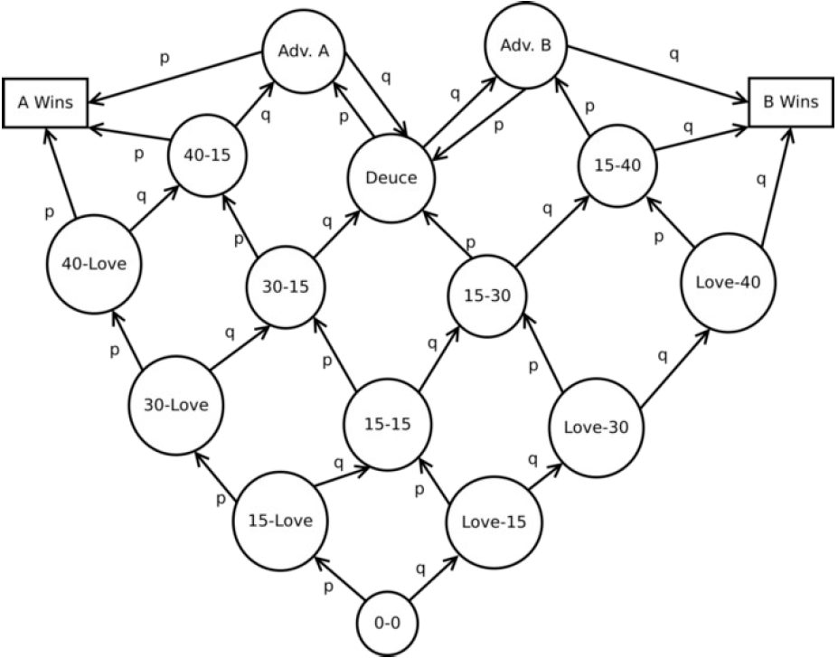

 
  

<h1 align="center"> Cadeias de Markov em simulação de um jogo de Tênis </h1>
<h3 align="center"> André Altoé, Eduardo Sarmento e Elciney Junior </h3>
<h3 align="center"> Prof. Rodolfo da Silva Villaça </h3>
<h5 align="center"> Processos Estocásticos Aplicados à Computação - <a href="https://www.ufes.br/">Universidade Federal do Espirito Santo</a></h5>

<!-- TABLE OF CONTENTS -->
<h2 id="summary"> :book: Sumário</h2>

  
Sumário

  <ol>
    <li><a href="#sobre"> ➤ Sobre</a></li>
    <li><a href="#tecnologias"> ➤ Tecnologias</a></li>
    <li><a href="#como-rodar"> ➤ Como Rodar</a></li>
    <li><a href="#cadeia-de-markov"> ➤ Cadeia de Markov</a></li>
    <li><a href="#estrutura-das-classes"> ➤ Estrutura das Classes</a></li>
    <li><a href="#estrutura-do-log"> ➤ Estrutura do Log</a></li>
    <li><a href="#manipulacao-do-dataset"> ➤ Manipulação do Dataset</a></li>
    <li><a href="#analise"> ➤ Análise dos dados</a></li>
    <li><a href="#conclusoes"> ➤ Conclusões</a></li>
    <li><a href="#creditos"> ➤ Creditos</a></li>
  </ol>

<h2 id="sobre"> :pencil: Sobre</h2>

 
Neste trabalho nos foi dado o objetivo de simular diferentes partidas de tênis representando o jogo por meio de uma cadeia de Markov, para então observar seu comportamento baseado na diferença da probabilidade de vitória dos adversários.

<h2 id="tecnologias"> :hammer: Tecnologias</h2>

<ul>
    <li>  Python</li>
    <li></li>
</ul>

<h2 id="como-rodar"> :nut_and_bolt: Como Rodar</h2>

 
    Você pode rodar as simulações simplesmente digitando o seguinte comando em seu terminal:

<pre><code>$ python main.py</code></pre>

<h2 id="cadeia-de-markov"> :loop: Cadeia de Markov</h2>

A seguinte cadeia de Markov foi modelada dentro do sistema, no arquivo <b>markov.py</b>

 
  

    O mesmo funciona chamando a funçao <b>markovWalk</b> utilizando do seu estado atual e sua direção P, que tem probabilidade p de ser escolhida, ou Q, que tem a probabilidade 1-p de ser escolhida, indicados no código como <b>markovWalkLeft</b> e <b>markovWalkRight</b> respectivamente, que são chamadas pela função <b>markovWalk</b> dependendo da direção escolhida.

<h2 id="estrutura-das-classes"> :loop: Estrutura das Classes</h2>

  Para o arquivo <strong>jogo.py</strong> existem 3 classes responsáveis pela representação de uma partida de Tênis. Sendo elas:

<ul>
  <li><strong>Game:</strong> Resposável por um único game. Faz o sorteio do número aleatório a cada round e move na cadeia de Markov conforme o jogador vencedor.</li>
  <li><strong>Set:</strong> Responsável por um único set. Joga novos games conforme ainda não se tem pontos suficientes pra declarar um dos jogadores como vencedor do respectivo set.</li>
  <li><strong>Partida:</strong> Responsável por uma única partida. Joga pelo menos 2 sets para se definir o vencedor da partida e salvar os resultados.</li>
</ul>

<h2 id="estrutura-do-log"> :pencil: Estrutura do Log</h2>

    Fizemos 2 logs diferentes, um log adequado para ser lido e entendido por humanos, o human_readable_log, que serve para podermos checar os resultados nós mesmos, nele temos para cada game como os pontos do jogo se desenvolveram durante os rounds e quem venceu o game, isso se repete até que um dos jogadores tenham 6 games ganham, então é indicado que o set acabou e quem ganhou o set, essa estrutura se repete por 3 sets e então temos o resultado da partida, com seu vencedor, quantos sets cada jogador ganhou, o total de games jogados e o total de rounds. Estes logs contem esses resultados para todas as n partidas simuladas e são criados para cada tipo de partida simulada, a com A sendo um jogador melhor que B e a com A sendo um jogador de igual habilidade que B.

    O Segundo log é o machine_readable_log, feito para ser usado como conjunto de dados analisados por código, nele temos para cada partida simulada o resultado do jogo, sendo 1 se foi o jogador A que ganhou e 0 se foi o jogador B, o número de sets ganhos por A, o número de sets ganhos por B, o número total de games jogados e o número total de rounds jogados durante a partida, nesta ordem e separados por vírgula. Esse log tambem é criado para cada tipo de partida e contém todas as n simulações dela.

<h2 id="manipulacao-do-dataset"> :nut_and_bolt: Manipulação do Dataset</h2>

    Utilizamos a biblioteca pandas para manipular e analisar o dataset, primeiro lemos o log machine_readable_log de cada tipo de partida usando a função do pandas read_csv, muito embora o log seja um txt pela estrutura dele ser similar a de um csv podemos usar esta função para ler e criar dois dataframes a partir de nosso dataset, um para cada tipo de partida, desses dataframes escolhemos aleatoriamente 3 partidas, usando a função sample, e então usamos a função describe para calcular e mostrar os resultados estatísticos necessários para fazermos a análise estatística pedida, isso é feito novamente, mas com uma amostra aleatória de 10 partidas, com isso temos as informações necessárias para fazermos as análises para respondermos às perguntas propostas no trabalho.

<h2 id="analise"> :chart_with_upwards_trend: Análise dos dados</h2>

  Dado que deixamos as probabilidades como:
  <ul>
  <li><strong>Partida 1:</strong> A=70% e B=30%</li>
  <li><strong>Partida 2:</strong> A=45% e B=55%</li>
</ul>

   Respondendo às perguntas feitas:

<ul>
  <li><strong>Qual a probabilidade do Jogador A/B vencerem as Partidas 1 e a Partidas 2?</strong></li>
  
Após rodar 30 simulações para cada partida e pegar 3 simulações aleatórias, obtivemos que a probabilidade de A ganhar na partida 1 é de 100%, porém na partida 2 a probabilidade ficou cerca de

   
  
  <li><strong>Qual a distribuição do número de sets, games e pontos nas Partidas 1 e 2?</strong> </li>
  

   
  
  <li><strong>Selecione aleatoriamente, com distribuição uniforme, 10 simulações dentre as n existentes em seus datasets originais. Refaça as 2 análises anteriores e explique as diferenças e semelhanças entre os resultados obtidos.</strong> </li>
  

   
</ul>

<h2 id="conclusoes"> :pencil: Conclusões</h2>

A partir dos dados obtivos pudemos perceber que por mais que seja pequena a vantagem do jogador durante <strong>cada round</strong> de um game, essa vantagem vai crescendo exponencialmente no cenário geral de uma partida, ou seja, com diversos rounds sendo jogados. Traduzindo-se em um grande percentual de vitórias pro jogador com a vantagem.

<h2 id="creditos"> :eyeglasses: Creditos</h2>

<h3>Execução</h3>
<ul>
    <li><a href="https://github.com/faakit/">André Altoé Santiago</a></li>
    <li><a href="https://github.com/eduardo-sarmento/">Eduardo Montagner de Moraes Sarmento</a></li>
    <li><a href="https://github.com/Elcineyjr/">Elciney Mendes Rangel Júnior</a></li>
</ul>

<h3>Base Teórica</h3>
- Professor Rodolfo da Silva Villaça
